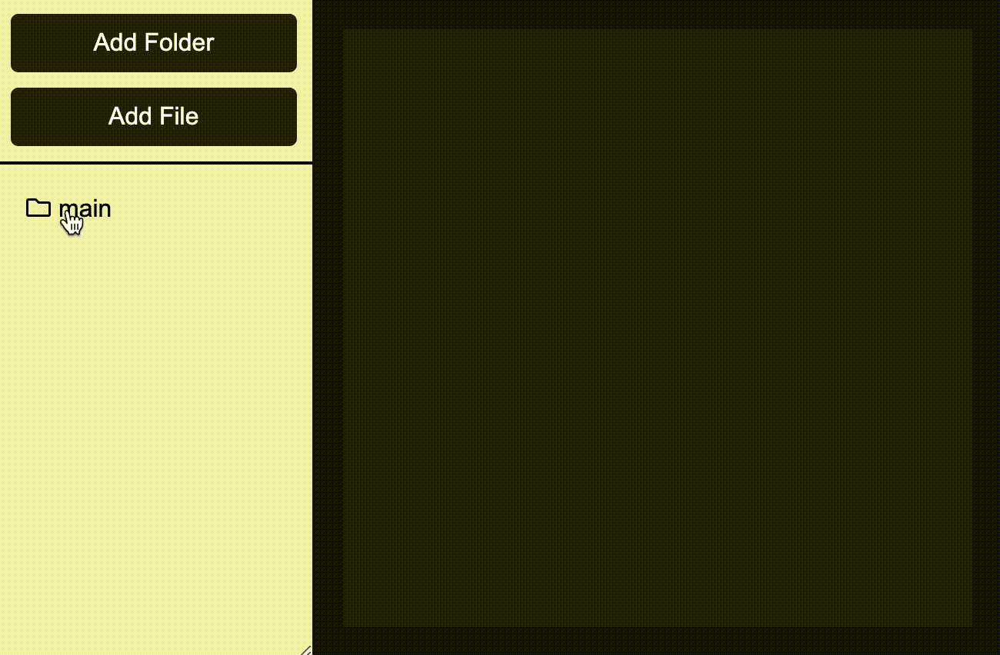

# react-tree-file-system

### 1 Demo



You can also try out [here](https://tharain.github.io/react-tree-file-system/)

### <a name="tree">2 Tree Structure</a>

```javascript
// Node
interface Node {
  title: string,
  isOpen?: boolean,
  isLocked?: boolean,
  isHidden?: boolean,
  children?: Node[],
  folderIcon?: React.Element,
  fileIcon?: React.Element,
  // able to add anything here
}

// Example
{
  title: 'main', // what is displayed
  isOpen: false, // optional
  type: 'folder',
  folderIcon: <FolderIcon /> // optional
  children: [
    {
      title: 'Child 1',
    },
    {
      title: 'Readme.md',
      fileIcon: <FileIcon />, // optional
      text: 'demo text'
    },
  ]
}
```

### 3 API

| Property | Description | Type | Default |
| :------: | :------: | :------: | :------: |
| value | The Tree structure given in [point 2](#tree) | Node[] | undefined |
| fileOnClick | Called when file is clicked | (event, indexes: number[], value: Node) => void | undefined |
| folderOnClick | Called when folder is clicked | (event, indexes: number[], state: boolean, value: Node) => void | undefined |
| onDrag | Called when something is dragged on folder | (event, fromIndexes, toIndexes) => void | undefined |
| folderIcon | Replace the default folder icon | JSX.Element | undefined |
| fileIcon | Replace the default file icon | JSX.Element | undefined |
| style | customize the general style | React.CSSProperties | undefined |
| isDraggable | customize the general style | React.CSSProperties | false |
